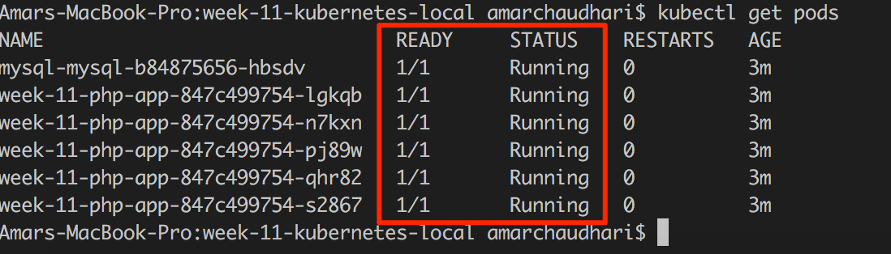
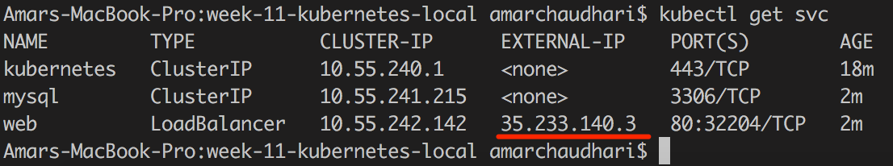
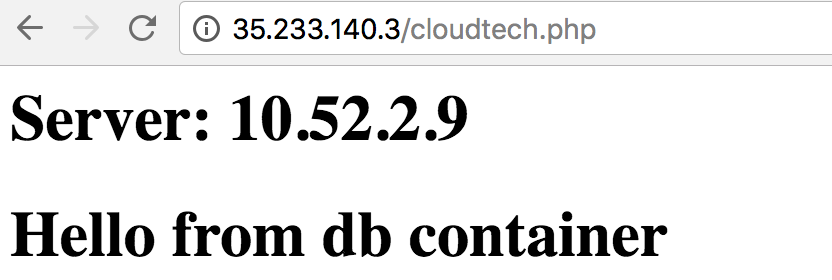

# Week 11 Home Work
This repository contains files needed replicate a simple version of our AWS Web Server Assignment, but instead of using two AWS Instances (Web Server and DB Server) we will use two containers and k8s.

## Instructions

This project uses kubernetes to to spin up docker containers.
The docker containers first need to be built locally and then pushed to google registry. Kubernetes will then pull the images from the registry and deploy accordingly.
1. Web Server - Apache + PHP
2. Database Server - Mysql

### Persistent Storage

The database server uses a volume in glcoud to store mysql files.

### How to Run

#### Start a kubernetes cluster on google cloud

    gcloud container clusters create amch1064-week-11 --num-nodes=3

    gcloud container clusters get-credentials amch1064-week-11

#### Build Docker images locally and push to google registry

    docker build -t week-11-web -f DockerWeb .
    docker tag week-11-web us.gcr.io/cloud-tech-week-11/cloud-tech:v1
    gcloud auth configure-docker
    docker push us.gcr.io/cloud-tech-week-11/cloud-tech:v1

**Check if the correct tag images has been pushed:**

    gcloud container images list-tags us.gcr.io/cloud-tech-week-11/cloud-tech

#### Kubernetes Deployment

**Create secret variables which are referenced from the specs:**

    kubectl create secret generic mysql-pass --from-literal=password="Super123"
    kubectl create secret generic mysql-credentials --from-literal=user="root"

**Deploy database service:**

    kubectl create -f mysql-deploy.yml

**Deploy web service:**

    kubectl create -f phpapp-deploy.yml

#### Verify Deployment status

    kubectl get deployment

**Get Pods status (must be 1/1 and running):**

    kubectl get pods

**Service will give us the load balancer public IP:**

    kubectl get svc

**Note the IP address**  

### Verify the deployment

**Check the web service status:**

    http://{LoadBalancer_IP}/cloudtech.php

**Check load balancing:**

    watch curl http://{LoadBalancer_IP}/cloudtech.php

### Clean UP

    kubectl delete -f phpapp-deploy.yml
    kubectl delete -f mysql-deploy.yml
